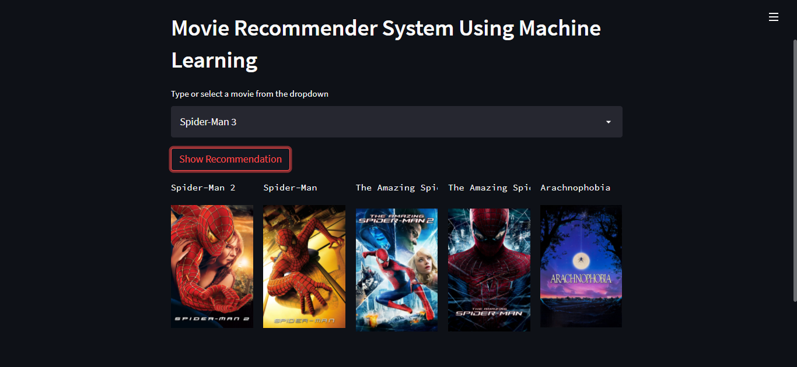
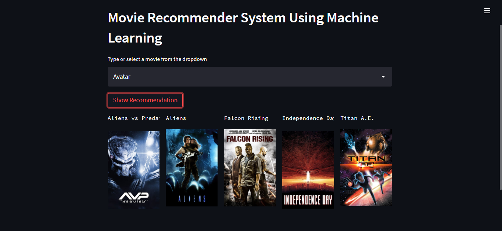
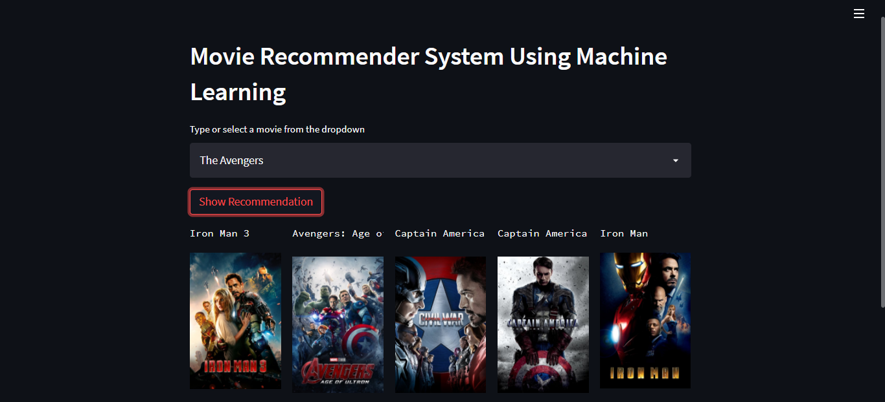

# MovieMate — Personalized Movie Recommender


Content-based movie recommendation system built with Streamlit and the TMDB API. Recommends 5 similar movies based on cosine similarity of movie features.

---

## How It Works

Recommendation types covered:

| Type | Description |
|------|-------------|
| **Content-Based** | Recommends based on movie attributes (genres, cast, keywords, overview). Used here. |
| **Collaborative** | Recommends based on user-item interaction clusters. |
| **Hybrid** | Combines both — used in production systems (Netflix, Spotify). |

**Similarity metric:** Cosine similarity on TF-IDF feature vectors. Score range `[0, 1]` — 1 = identical, 0 = no overlap.

---

## Project Structure

```
moviemate-personalized-movie-recommender/
├── app.py                        # Streamlit UI entry point
├── src/
│   ├── recommender.py            # recommend() + load_data()
│   └── utils/
│       └── api.py                # TMDB poster fetch
├── notebooks/
│   └── movie_recommender_analysis.ipynb   # EDA + model training
├── artifacts/
│   ├── movie_dict.pkl            # processed movie data
│   └── similarity.pkl            # cosine similarity matrix
├── data/                         # raw TMDB dataset (gitignored)
├── demo/                         # screenshots
├── .env.example                  # env template (commit this)
├── .env.local                    # local secrets (gitignored)
├── requirements.txt
└── setup.py
```

---

## Quickstart

### 1. Clone

```bash
git clone https://github.com/pankaj2k9/moviemate-personalized-movie-recommender.git
cd moviemate-personalized-movie-recommender
```

### 2. Create environment

```bash
conda create -n moviemate python=3.10 -y
conda activate moviemate
```

### 3. Install dependencies

```bash
pip install -r requirements.txt
```

### 4. Set up environment variables

```bash
cp .env.example .env.local
# edit .env.local — add your TMDB_API_KEY
```

Get a free TMDB API key at [themoviedb.org/settings/api](https://www.themoviedb.org/settings/api).

### 5. Generate model artifacts

Run the notebook to produce `artifacts/movie_dict.pkl` and `artifacts/similarity.pkl`:

```bash
jupyter notebook notebooks/movie_recommender_analysis.ipynb
```

### 6. Run the app

```bash
streamlit run app.py
```

---

## Dataset

[TMDB 5000 Movie Dataset](https://www.kaggle.com/tmdb/tmdb-movie-metadata?select=tmdb_5000_movies.csv) — Kaggle

---

## Demo







---

## Author

**Pankaj Kumar Pramanik** — Data Scientist  
pkp2.me2k9@gmail.com  
[github.com/pankaj2k9](https://github.com/pankaj2k9)
